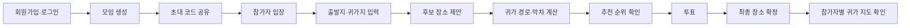
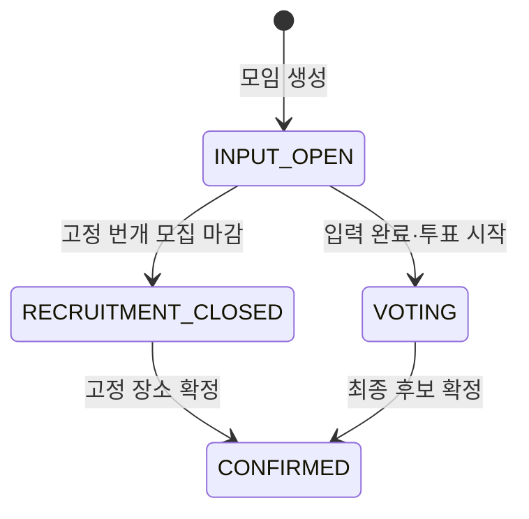
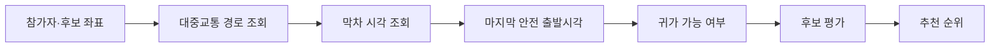
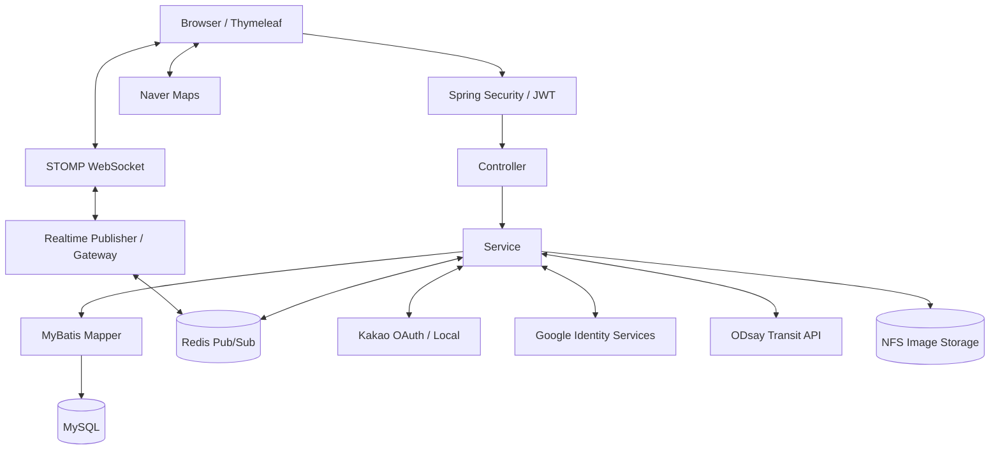
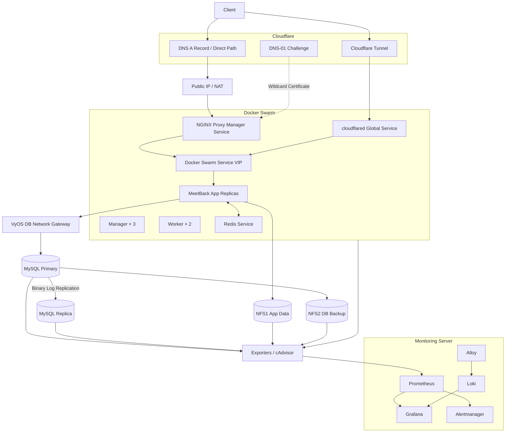

# MeetBack

> 참가자 모두의 귀가 가능 시간과 이동 부담을 계산해, 안전성과 공정성을 함께 고려한 모임 장소를 추천하는 서비스

MeetBack은 단순히 중간 지점을 찾는 서비스가 아닙니다. 참가자의 출발지·귀가지, 모임 희망 종료시간, 대중교통 경로와 막차 정보를 결합해 후보별 귀가 가능 여부를 계산하고, 평균 귀가시간·이동시간 편차·환승 횟수를 점수화해 추천 순위를 제공합니다.


## 목차

- [서비스 흐름](#서비스-흐름)
- [모임 유형](#모임-유형)
- [주요 기능](#주요-기능)
- [추천 로직](#추천-로직)
- [기술 스택](#기술-스택)
- [애플리케이션 구조](#애플리케이션-구조)
- [인프라 아키텍처](#인프라-아키텍처)
- [로컬 실행](#로컬-실행)
- [Docker 실행](#docker-실행)
- [API 개요](#api-개요)
- [프로젝트 구조](#프로젝트-구조)
- [테스트](#테스트)
- [현재 운영 범위](#현재-운영-범위)

## 서비스 흐름



모임 유형에 따라 다음 상태를 거칩니다.



## 모임 유형

| 유형 | 코드 | 설명 |
|---|---|---|
| 친구 모임 | `FRIEND` | 초대 코드로 참가자를 모으고, 위치 입력·추천 계산·전원 투표를 거쳐 장소를 확정합니다. |
| 투표형 번개 | `QUICK_VOTE` | 공개 번개방에서 후보를 투표하며, 과반수가 투표한 뒤 단독 최다 득표 후보를 확정합니다. |
| 고정형 번개 | `QUICK_FIXED` | 주최자가 장소와 종료시간을 먼저 정하고 참가자를 모집합니다. 참가자는 자신의 귀가 가능 여부를 미리 확인할 수 있습니다. |

## 주요 기능

### 회원·인증

- 이메일 회원가입·로그인, 이메일·닉네임 중복 확인
- Kakao OAuth 및 Google Identity Services 간편 로그인
- Access/Refresh JWT 발급·재발급·로그아웃
- Refresh Token 원문 대신 SHA-256 해시 저장
- 이메일 찾기와 메일 기반 비밀번호 재설정
- 회원 탈퇴·탈퇴 취소와 약관 동의 관리
- 관리자 권한 기반 약관 등록·변경 이력 조회

### 모임·참가자

- 일반 모임, 투표형 번개, 고정형 번개 생성
- 초대 코드 참여와 공개 번개방 검색·참여
- 참가자 위치 입력, 제출·수정·수정 취소 상태 관리
- 참가자 강퇴·강퇴 취소·번개방 나가기
- 모집 마감, 투표 시작, 최종 후보 확정
- 내 모임과 내 번개 모임 목록 조회

### 장소·추천·귀가

- Kakao Local API 기반 장소 검색
- ODsay API 기반 대중교통 경로·막차 조회
- 후보별 참가자 전원의 귀가 가능 여부 계산
- 마지막 안전 출발시각, Deadline, Golden Margin 계산
- 평균 귀가시간, Fairness Gap, 환승 횟수 기반 추천 순위
- Naver Maps 기반 참가자별 귀가 경로 표시
- 고정형 번개에서 DB를 변경하지 않는 귀가 가능 여부 미리보기

### 실시간 통신

- `/ws` STOMP WebSocket 연결과 JWT 기반 CONNECT·SUBSCRIBE 검증
- 모임별 채팅, 참가자 접속 상태, 위치 제출, 투표, 확정 이벤트 전파
- `PRESENCE_UPDATED`, `VOTE_UPDATED`, `MEETING_CONFIRMED` 등 도메인 이벤트 사용
- Redis Pub/Sub으로 여러 애플리케이션 Replica 사이 이벤트 전달
- 로컬 발행·Redis 재수신 중복 방지와 세션 교체 처리
- STOMP Heartbeat와 재연결 후 참가자·채팅 상태 복구

### 피드

- 피드 작성·목록·상세·수정·삭제
- 이미지 다중 업로드와 공유 스토리지 저장
- 댓글 작성·조회·수정·삭제
- 좋아요 등록·취소·상태 조회

## 추천 로직

MeetBack은 후보마다 참가자 전원의 귀가 결과를 먼저 계산한 뒤 후보 평가를 저장합니다.



### 1. 귀가 가능 여부

```text
마지막 안전 출발시각 = 막차 출발시각 - 안전 여유시간
귀가 가능 = 모임 희망 종료시간 <= 마지막 안전 출발시각
```

도보 귀가가 가능한 경우에는 막차 제한 없이 별도 도보 결과를 사용합니다.

### 2. 후보 평가 지표

| 지표 | 계산 방식 |
|---|---|
| Deadline | 막차를 이용하는 참가자들의 마지막 안전 출발시각 중 가장 빠른 시각 |
| Golden Margin | `Deadline - 모임 희망 종료시간` |
| 평균 귀가시간 | 후보 장소에서 참가자별 귀가지까지의 평균 이동시간 |
| Fairness Gap | 가장 긴 귀가시간과 가장 짧은 귀가시간의 차이 |
| Fairness Score | Gap이 10/20/30/40분 이하일 때 각각 50/40/30/20점, 초과 시 10점 |

### 3. Rule Score

```text
Rule Score = 평균 귀가시간 점수 + Fairness Score - 전체 환승 횟수 × 5
```

- 전원이 귀가할 수 없는 후보는 0점으로 처리합니다.
- 평균 귀가시간 점수와 Fairness Score는 각각 최대 50점입니다.
- 최종 점수는 0~100 범위로 제한합니다.

### 4. 최종 정렬 기준

1. Rule Score가 높은 후보
2. 동점이면 Golden Margin이 큰 후보
3. 다시 동점이면 평균 귀가시간이 짧은 후보

계산 결과에는 `calculationVersion`을 저장해 재계산 결과와 이전 결과가 섞이지 않도록 합니다.

## 기술 스택

| 분류 | 기술 |
|---|---|
| Language | Java 17 |
| Framework | Spring Boot 4.1.0, Spring MVC, Spring Security |
| View | Thymeleaf, HTML, CSS, JavaScript |
| Realtime | STOMP WebSocket, Redis 7 Pub/Sub |
| Persistence | MyBatis 4.0.1, Flyway |
| Database | MySQL 8.x Primary/Replica |
| Authentication | JJWT 0.13.0, BCrypt, Kakao OAuth, Google Identity Services |
| External API | Kakao Local, ODsay, Naver Maps, SMTP |
| Build·Runtime | Maven Wrapper, Docker Multi-stage Build, Eclipse Temurin 17 |
| Orchestration | Docker Swarm, Overlay Network, Service VIP |
| Edge | Cloudflare DNS·Tunnel, cloudflared, NGINX Proxy Manager |
| Storage | NFSv4 공유 볼륨, DB Backup Storage |
| Monitoring | Prometheus, Grafana, Alertmanager, Loki, Alloy, node_exporter, cAdvisor, mysqld_exporter |
| Test | JUnit 5, Mockito, AssertJ, Spring Boot Test |

## 애플리케이션 구조



계층별 책임은 다음과 같습니다.

- `controller`: HTTP·STOMP 요청 수신과 응답 변환
- `service`: 인증, 모임, 추천, 투표, 피드 등 업무 규칙과 트랜잭션
- `realtime`: 로컬 WebSocket 전달과 Redis 기반 Replica 간 이벤트 전파
- `repository`·`resources/mapper`: MyBatis 인터페이스와 SQL 매핑
- `domain`·`dto`: 영속 객체, 상태 enum, API 요청·응답 모델
- `oauth`·`place`·`transport`: 외부 인증·장소·교통 API 연동
- `security`: HTTP와 STOMP JWT 인증·권한 검증
- `scheduler`: 만료 Refresh Token과 만료 모임 정리

## 인프라 아키텍처

운영 구성은 애플리케이션 실행 계층과 DB·스토리지·모니터링 계층을 분리합니다.



### 외부 진입 경로

- **Cloudflare Tunnel 경로:** 각 Swarm 노드의 `cloudflared` Global Service가 Tunnel 요청을 받아 애플리케이션 Service VIP로 전달합니다.
- **NPM 직접 경로(보조 경로):** A 레코드를 공개할 때는 Tunnel을 거치지 않고 공인 IP/NAT를 통해 NGINX Proxy Manager로 연결합니다.
- NPM은 Cloudflare API 기반 DNS-01 Challenge로 `*.meetback.date` 와일드카드 인증서를 관리하고, 443 포트에서 TLS를 종료한 뒤 Swarm Service VIP로 Reverse Proxy합니다.
- NPM과 cloudflared는 서로 독립된 진입 경로이며 VyOS를 통과하지 않습니다. VyOS는 DB 망 분리와 라우팅 역할을 담당합니다.

### Swarm·데이터 계층

- Manager 3대와 Worker 2대로 Swarm을 구성합니다.
- 애플리케이션은 Worker에 Replicated Service로 배포하며 `endpoint_mode: vip`를 사용합니다.
- `meetback-edge`와 `meetback-backend` Overlay Network로 외부 진입과 내부 데이터 통신을 분리합니다.
- Redis Pub/Sub은 여러 애플리케이션 Replica의 WebSocket 이벤트를 동기화합니다.
- MySQL은 Primary/Replica 비동기 복제 구조이며 장애 시 수동 승격 절차를 사용합니다.
- NFS1은 피드 이미지 등 애플리케이션 공유 파일을 제공하고, NFS2는 DB Backup과 운영 파일 보관에 사용합니다.

### 모니터링 범위

- Prometheus는 Swarm Node, cAdvisor, MySQL, NFS와 모니터링 서비스 지표를 수집합니다.
- Grafana에는 Prometheus와 Loki가 데이터소스로 등록되어 있습니다.
- Alertmanager는 Prometheus Alert Rule을 받아 Telegram Receiver로 전달합니다.
- 현재 Alloy는 모니터링 서버의 Docker 로그를 Loki로 전송합니다. NFS1·NFS2 시스템 로그는 현재 Loki 수집 범위에 포함되지 않습니다.

> 인프라 README는 구성 구조를 설명합니다. 일시적인 노드 장애나 Replica 수 변화는 운영 상태 점검 결과에서 별도로 관리합니다.

## 로컬 실행

### 필수 환경

- JDK 17
- MySQL 8.x
- Maven Wrapper 사용 가능 환경
- Redis 7.x — 다중 인스턴스 실시간 모듈을 사용할 때 필요
- Kakao, Google, ODsay, Naver Maps API 자격 증명

### 저장소 준비

```bash
git clone https://github.com/nembutal-sw/meetback.git
cd meetback
```

`.env.example`을 `.env`로 복사한 뒤 실제 환경에 맞게 값을 입력합니다.

```bash
cp .env.example .env
```

Windows PowerShell:

```powershell
Copy-Item .env.example .env
```

### 주요 환경 변수

| 그룹 | 환경 변수 |
|---|---|
| Database | `DB_HOST`, `DB_PORT`, `DB_NAME`, `DB_USERNAME`, `DB_PASSWORD` |
| Redis | `REDIS_HOST`, `REDIS_PORT`, `REDIS_REALTIME_ENABLED`, `REDIS_MEETING_CHANNEL`, `REDIS_AUTH_CHANNEL` |
| JWT | `JWT_SECRET`, `JWT_ACCESS_TOKEN_EXPIRATION`, `JWT_REFRESH_TOKEN_EXPIRATION` |
| Kakao | `KAKAO_CLIENT_ID`, `KAKAO_REDIRECT_URI`, `KAKAO_CLIENT_SECRET`, `KAKAO_REST_API_KEY` |
| Google | `GOOGLE_CLIENT_ID` |
| Transport·Map | `ODSAY_API_KEY`, `ODSAY_BASE_URL`, `NAVER_MAPS_CLIENT_ID`, `NAVER_MAPS_CLIENT_SECRET` |
| Mail | `MAIL_HOST`, `MAIL_PORT`, `MAIL_USERNAME`, `MAIL_PASSWORD` |
| Application | `APP_BASE_URL`, `FEED_IMAGE_UPLOAD_DIR` |

`JWT_SECRET`은 최소 256bit 이상의 임의 바이트를 Base64로 인코딩해 사용합니다. 실제 비밀번호와 API Key는 README, `.env.example`, Git 이력에 저장하지 않습니다.

### DB Migration

Flyway가 애플리케이션 시작 시 다음 Migration을 순서대로 적용하고 검증합니다.

- `V1__initial_schema.sql`: 초기 테이블·인덱스·외래키 구성
- `V2__upsert_terms.sql`: 서비스 약관 초기 데이터와 갱신

기존 스키마를 참고해야 할 때는 [`db/schema.sql`](db/schema.sql)을 사용하되, 신규 환경 초기화는 Flyway Migration을 기준으로 합니다.

### 애플리케이션 실행

macOS/Linux:

```bash
./mvnw spring-boot:run
```

Windows:

```powershell
.\mvnw.cmd spring-boot:run
```

기본 접속 주소:

```text
http://localhost:8080/
```

Health Check:

```text
http://localhost:8080/actuator/health
http://localhost:8080/livez
http://localhost:8080/readyz
```

로컬에서 Redis 없이 실행하려면 `REDIS_REALTIME_ENABLED=false`를 사용합니다. 여러 애플리케이션 인스턴스를 실행할 때는 Redis를 준비하고 값을 `true`로 변경해야 합니다.

## Docker 실행

Dockerfile은 다음 운영 기준을 적용합니다.

- Temurin 17 JDK/JRE Multi-stage Build
- 런타임 이미지에 빌드 도구 제외
- UID/GID 10001의 비루트 `meetback` 사용자
- `no-new-privileges`와 Linux Capability 제거
- `SIGTERM`과 30초 Graceful Shutdown
- `/app/uploads/feed` 공유 볼륨 사용

로컬 Docker Compose 실행:

```bash
docker compose up --build
```

Swarm 배포에서는 Registry에 Push한 고정 이미지 태그를 `MEETBACK_IMAGE`로 지정하고, 외부 Overlay Network와 NFS Export를 준비합니다.

```bash
docker build -t <registry>/meetback:<tag> .
docker push <registry>/meetback:<tag>

export MEETBACK_IMAGE=<registry>/meetback:<tag>
docker stack deploy -c docker-compose.yaml meetback
```

주요 배포 변수:

| 변수 | 기본값 | 설명 |
|---|---|---|
| `MEETBACK_IMAGE` | `meetback:latest` | 배포할 애플리케이션 이미지 |
| `MEETBACK_REPLICAS` | `3` | 애플리케이션 Replica 수 |
| `MEETBACK_EDGE_NETWORK` | `meetback-edge` | 외부 진입용 Overlay Network |
| `NFS_APP_HOST` | `10.7.10.8` | 애플리케이션 공유 볼륨 NFS 서버 |
| `NFS_APP_EXPORT` | `/srv/nfs/app-data` | NFS Export 경로 |

운영 배포에서는 `.env` 파일보다 Docker Secret과 노드별 운영 환경 변수를 우선 사용합니다.

## API 개요

아래 표는 주요 Endpoint만 요약합니다. 대부분의 업무 API는 `Authorization: Bearer {accessToken}`을 요구합니다.

### 인증

| Method | Endpoint | 설명 |
|---|---|---|
| `POST` | `/auth/signup` | 이메일 회원가입 |
| `POST` | `/auth/login` | 로그인과 JWT 발급 |
| `POST` | `/auth/kakao` | Kakao 로그인 |
| `POST` | `/auth/google` | Google ID Token 검증·로그인 |
| `POST` | `/auth/social/complete` | 신규 소셜 사용자 가입 완료 |
| `POST` | `/auth/refresh` | Access/Refresh Token 재발급 |
| `POST` | `/auth/logout` | 로그아웃과 Refresh Token 폐기 |
| `POST` | `/auth/password/reset/request` | 비밀번호 재설정 메일 요청 |
| `POST` | `/auth/password/reset/confirm` | 비밀번호 재설정 확정 |

### 모임·참가자

| Method | Endpoint | 설명 |
|---|---|---|
| `POST` | `/meetings` | 모임 생성 |
| `POST` | `/meetings/join` | 초대 코드·공개 번개방 참여 |
| `GET` | `/meetings/my` | 내 모임 조회 |
| `GET` | `/meetings/quick` | 공개 번개방 조회 |
| `PATCH` | `/meetings/{meetingId}/recruitment/close` | 고정 번개 모집 마감 |
| `PUT` | `/participants/{participantId}/location` | 출발지·귀가지 저장 |
| `PUT` | `/participants/{participantId}/submit` | 참가자 입력 제출 |
| `DELETE` | `/participants/{participantId}/kick` | 참가자 강퇴 |
| `DELETE` | `/participants/{participantId}/leave` | 번개방 나가기 |

### 후보·추천·투표

| Method | Endpoint | 설명 |
|---|---|---|
| `POST` | `/participants/{participantId}/candidate` | 후보 장소 등록 |
| `POST` | `/calculations/meeting` | 모임 전체 후보 계산·평가 |
| `GET` | `/calculations/meeting/recommendation` | 추천 1위 조회 |
| `GET` | `/calculations/meeting/ranking` | 후보 전체 순위 조회 |
| `POST` | `/calculations/meeting/{meetingId}/quick-fixed/preview` | 고정 번개 귀가 결과 미리보기 |
| `PUT` | `/meetings/{meetingId}/votes` | 투표·재투표 |
| `PUT` | `/meetings/{meetingId}/final-candidate` | 최종 후보 확정 |
| `GET` | `/api/routes/{candidateId}/{participantId}/map` | 참가자 귀가 지도 조회 |

### 실시간·피드

| 구분 | Endpoint | 설명 |
|---|---|---|
| WebSocket | `/ws` | STOMP Handshake |
| STOMP SEND | `/app/meetings/{meetingId}/chat` | 채팅 전송 |
| STOMP SUBSCRIBE | `/topic/meetings/{meetingId}/chat` | 모임 이벤트·채팅 구독 |
| STOMP SUBSCRIBE | `/topic/quick-meetings` | 공개 번개방 목록 변경 구독 |
| REST | `/api/feeds` | 피드 작성·목록 |
| REST | `/api/feeds/{feedId}/comments` | 댓글 작성·조회 |
| REST | `/api/feeds/{feedId}/likes` | 좋아요 등록·조회 |

## 프로젝트 구조

```text
meetback/
├── Dockerfile
├── docker-compose.yaml
├── db/
│   └── schema.sql
├── src/main/java/com/meetback/dev/
│   ├── WebSocket/                 # 연결·Presence 이벤트 처리
│   ├── config/                    # Security, WebSocket, Web 설정
│   ├── controller/                # REST·화면·STOMP Controller
│   ├── domain/                    # Domain과 상태 enum
│   ├── dto/                       # 요청·응답 DTO
│   ├── oauth/                     # Kakao·Google 연동
│   ├── place/                     # Kakao Local 연동
│   ├── realtime/                  # Redis 기반 Replica 간 이벤트 전달
│   ├── repository/                # MyBatis Mapper 인터페이스
│   ├── scheduler/                 # Token·모임 정리 작업
│   ├── security/                  # HTTP·STOMP JWT 인증
│   ├── service/                   # 핵심 업무 로직
│   └── transport/                 # ODsay 경로·막차 연동
├── src/main/resources/
│   ├── db/migration/              # Flyway Migration
│   ├── mapper/                    # MyBatis XML
│   ├── static/                    # CSS, JavaScript, 이미지
│   ├── templates/                 # Thymeleaf 화면
│   └── application.properties
└── src/test/                      # 인증·실시간 모듈 테스트
```

## 테스트

전체 테스트 실행:

macOS/Linux:

```bash
./mvnw test
```

Windows:

```powershell
.\mvnw.cmd test
```

현재 자동화 테스트는 다음 영역을 중심으로 구성되어 있습니다.

- Google 신규·기존 사용자 로그인과 계정 연결 정책
- Redis 실시간 모듈 활성화 조건
- 실시간 이벤트 직렬화·역직렬화
- 로컬 WebSocket 전달과 Redis 발행 결과
- Redis Subscriber의 이벤트 수신·중복 방지

운영 배포 검증에서는 추가로 회원가입부터 모임 생성·참여·추천·투표·확정·귀가 지도까지의 다중 사용자 E2E 시나리오를 확인합니다.

## 현재 운영 범위

### 적용된 항목

- Dockerfile 기반 애플리케이션 이미지와 Flyway 자동 Migration
- Docker Swarm Service VIP와 Redis 기반 다중 Replica 실시간 통신
- MySQL Primary/Replica, NFS 공유 저장소와 DB Backup
- Cloudflare Tunnel 운영 진입 경로
- NPM의 DNS-01 와일드카드 인증서·TLS 종료·Reverse Proxy 설정
- Prometheus·Grafana·Alertmanager 기반 지표·알림 통합
- Loki·Alloy 기반 모니터링 서버 컨테이너 로그 수집

### 의도적으로 자동화하지 않은 항목

- MySQL 자동 Failover: 데이터 일관성과 승격 판단을 위해 수동 절차 사용
- NFS 자동 Failover: 단일 Export 전환과 복구 절차를 운영 문서로 관리

### 후속 범위

- NFS1·NFS2 시스템 로그의 Alloy·Loki 수집
- 직접 A 레코드 경로의 외부 DNS·NAT E2E 검증
- 서비스 로직 전 영역에 대한 자동화 테스트 확대

## 보안 주의사항

- `.env`와 운영 Secret은 Git에 커밋하지 않습니다.
- API Key, Client Secret, JWT Secret, DB·Redis 비밀번호를 문서·이슈·로그에 출력하지 않습니다.
- Google ID Token은 서명, 발급자, 만료시간과 Audience를 서버에서 검증합니다.
- Access/Refresh JWT는 HMAC으로 서명하며, DB에는 Refresh Token 해시만 저장합니다.
- 운영 외부 요청은 NPM 또는 Cloudflare Tunnel의 TLS 경로를 사용합니다.
- 업로드 파일 형식·크기와 피드 작성 권한을 서버에서 다시 검증합니다.

## License

이 프로젝트는 [MIT License](LICENSE)를 따릅니다.
