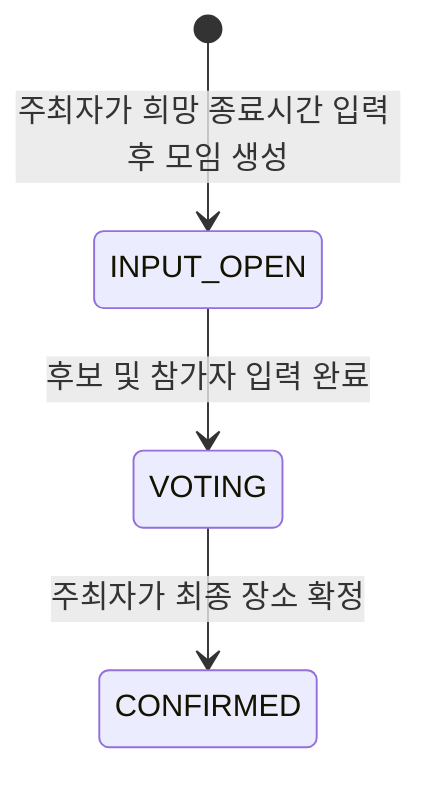
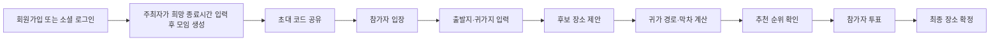
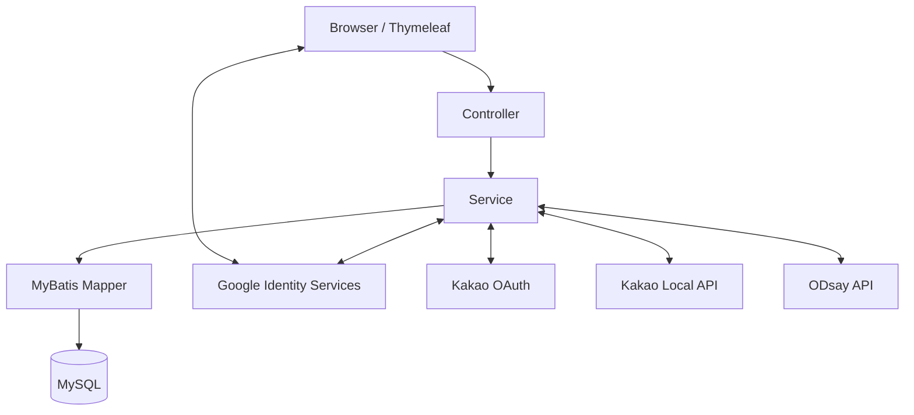
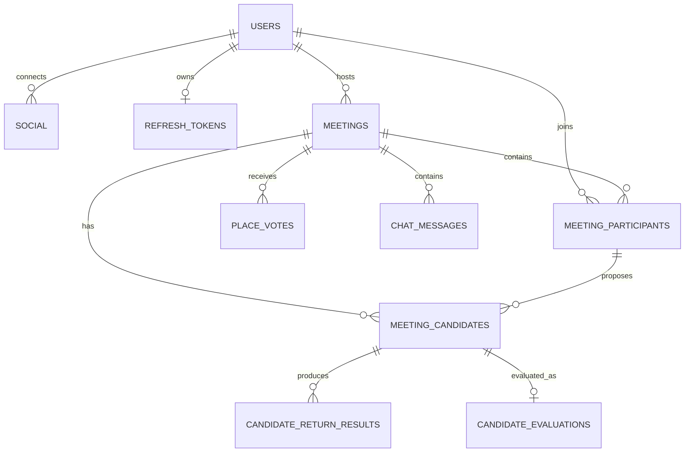

# MeetBack

**막차 걱정은 덜고, 오늘은 더 오래.**

MeetBack은 참가자별 지하철 막차를 계산해 모두가 귀가 가능한 헤어질 시간을 안내하고, 더 머물고 싶을 때 What-if로 다시 계산하는 서비스입니다. 장소 후보 제안과 투표부터 참가자별 귀가 경로·막차 확인까지 하나의 모임 흐름으로 제공합니다.

> 현재 저장소는 개발 진행 중인 팀 프로젝트입니다. 일부 화면과 경로 조회 API는 기능 검증용 페이지 및 엔드포인트를 포함합니다.

## 주요 기능

### 회원 및 인증

- 이메일 기반 회원가입·로그인
- Kakao OAuth 간편 로그인·회원가입
- Google Identity Services 간편 로그인·회원가입
- HMAC 기반으로 서명된 MeetBack Access/Refresh JWT 발급
- Refresh Token 원문 대신 별도의 SHA-256 해시 저장 및 만료 토큰 정리
- 로그인 상태 확인, 로그아웃, 회원 탈퇴 및 탈퇴 취소

Google 로그인은 Google ID Token의 서명, 발급자, 만료시간과 MeetBack Client ID 대상 여부를 서버에서 검증합니다. 신규 Google 사용자의 프로필 이름은 `users.nickname`으로 저장하며 이름과 생년월일은 별도로 저장하지 않습니다.

### 모임 관리

- 주최자가 모임 제목과 희망 종료시간을 입력하여 모임 생성 및 초대 코드 발급
- 초대 코드를 이용한 모임 참여
- 모임 참가자와 입력 상태 관리
- 투표 시작 및 주최자의 최종 후보 확정



### 장소 입력 및 후보 관리

- Kakao Local API 기반 장소 검색
- 참가자의 출발지·귀가지 등록 및 수정
- 참가자별 후보 장소 제안
- 모든 참가자의 입력 완료 여부 확인

### 추천 계산

- 후보 장소별 참가자 전원의 귀가 경로 계산
- ODsay API 기반 지하철 귀가 경로 및 막차 조회
- 참가자별 귀가 가능 여부와 최종 출발 시각 계산
- 평균 귀가시간, 이동시간 편차, 공정성 점수 계산
- 전체 귀가 가능 여부와 규칙 점수를 이용한 후보 순위 제공

### 투표 및 기타 기능

- 후보 장소 투표·재투표
- 후보별 득표 결과 조회
- 모임 채팅 메시지 조회

## 서비스 흐름



## 기술 스택

| 분류 | 기술 |
|---|---|
| Language | Java 17 |
| Framework | Spring Boot 4.1.0, Spring Web MVC |
| View | Thymeleaf, HTML, JavaScript |
| Persistence | MyBatis 4.0.1 |
| Database | MySQL |
| Authentication | JJWT 0.13.0(HMAC JWT 서명), BCrypt, Google Identity Services, Kakao OAuth |
| External API | Kakao Local API, ODsay API |
| Build | Maven Wrapper |
| Test | JUnit 5, Mockito, AssertJ, Spring Boot Test |
| Utility | Lombok, Spring RestClient, Spring Scheduling |

## 시스템 구조



계층별 책임은 다음과 같습니다.

- `controller`: HTTP 요청·응답 및 화면 라우팅
- `service`: 인증, 모임, 계산, 투표 등 업무 규칙과 트랜잭션
- `repository`: MyBatis Mapper 인터페이스
- `resources/mapper`: SQL 및 도메인 객체 매핑
- `domain`: DB 레코드에 대응하는 도메인 객체
- `dto`: API 요청과 응답 데이터
- `oauth`: Kakao 및 Google 인증 제공자 연동
- `place`: Kakao Local 장소 검색 연동
- `transport`: ODsay 지하철 귀가 경로·막차 연동
- `security`: MeetBack JWT 생성 및 검증
- `scheduler`: 만료된 Refresh Token 정리

## 프로젝트 구조

```text
meetback/
├── db/
│   └── schema.sql                         # 최신 스키마 참고본
├── src/main/java/com/meetback/dev/
│   ├── config/                            # 공통 설정
│   ├── controller/                        # REST 및 화면 Controller
│   ├── domain/                            # 도메인 객체와 상태 enum
│   ├── dto/                               # 요청·응답 DTO
│   ├── exception/                         # 전역 예외 처리
│   ├── oauth/                             # Kakao·Google 인증 연동
│   ├── place/                             # Kakao Local 장소 검색
│   ├── repository/                        # MyBatis Mapper 인터페이스
│   ├── scheduler/                         # Refresh Token 정리 작업
│   ├── security/                          # JWT 처리
│   ├── service/                           # 핵심 업무 로직
│   └── transport/                         # ODsay 교통 연동
├── src/main/resources/
│   ├── db/migration/                      # Flyway 버전 마이그레이션
│   ├── mapper/                            # MyBatis XML SQL
│   ├── templates/                         # Thymeleaf 화면
│   └── application.properties
├── src/test/                              # 단위 및 애플리케이션 테스트
├── Dockerfile                             # JDK 17 애플리케이션 이미지
├── compose.yaml                           # 애플리케이션·MySQL 실행 구성
├── .dockerignore                          # Docker 빌드 제외 목록
├── .env.example                           # 환경 변수 예시
├── pom.xml
└── README.md
```

## 시작하기

### 필수 환경

- JDK 17 이상
- MySQL 8.x 권장
- Docker Engine 및 Docker Compose v2(컨테이너 실행 시)
- Google OAuth Web Client ID
- Kakao OAuth Client ID 및 Client Secret
- Kakao Local REST API Key
- ODsay API Key 및 Base URL

Java 버전을 확인합니다.

```bash
java -version
```

### 저장소 받기

```bash
git clone https://github.com/nembutal-sw/meetback.git
cd meetback
```

### 데이터베이스 준비

Docker Compose 사용을 권장합니다. MySQL 컨테이너는 빈 데이터 볼륨에서
`meet_back` 데이터베이스를 만들고, 애플리케이션 시작 시 Flyway가
`src/main/resources/db/migration`의 마이그레이션을 순서대로 적용합니다.

먼저 `.env.example`을 `.env`로 복사하고 비밀번호와 외부 API 설정을 실제
환경 값으로 채웁니다. Docker Compose는 DB 이름과 애플리케이션 DB 사용자를
각각 `meet_back`, `meetback`으로 고정합니다. 앱은 호스트의 `.env`를
`/app/config/.env`에 읽기 전용으로 bind mount해 토큰을 읽습니다.
MySQL root 비밀번호는 앱과 분리된 `secrets/mysql_root_password` 파일을 사용합니다.

```bash
docker compose config --quiet
docker compose up --build
```

최초 실행 결과는 다음과 같습니다.

1. MySQL이 `meet_back` 데이터베이스와 애플리케이션 사용자를 생성합니다.
2. MySQL healthcheck가 통과한 뒤 애플리케이션이 시작됩니다.
3. Flyway가 V1 스키마, V2 회원 상태, V3 초기 관리자 계정을 순서대로 적용합니다.
4. `flyway_schema_history`에 적용 이력이 기록됩니다.

빈 DB의 최초 관리자 로그인 ID와 비밀번호는 모두 `admin`입니다. 최초 로그인 후
관리자 페이지의 **내 계정**에서 로그인 ID와 비밀번호를 즉시 변경합니다. 기존
관리자 계정이 있거나 `admin` 값이 이미 사용 중이면 V3는 중복 계정을 만들지 않습니다.

이후 스키마 변경은 이미 적용된 파일을 수정하지 않고 `V4__...sql`,
`V5__...sql`처럼 새 마이그레이션으로 추가합니다.

V1은 `db/schema.sql`에 있는 스키마만 생성하며 약관 문구를 임의로 넣지 않습니다.
승인된 약관의 문구와 버전이 확정되면 별도 마이그레이션으로 추가합니다.

로컬 MySQL을 직접 사용하는 경우에는 데이터베이스와 전용 사용자를 먼저 생성합니다.

```sql
CREATE DATABASE meet_back
    CHARACTER SET utf8mb4
    COLLATE utf8mb4_unicode_ci;

CREATE USER IF NOT EXISTS 'meetback'@'localhost'
    IDENTIFIED BY 'your-db-password';
GRANT ALL PRIVILEGES ON meet_back.* TO 'meetback'@'localhost';
```

접속 정보를 `.env`에 입력하고 애플리케이션을 시작하면 Flyway가 테이블을
자동 생성합니다. `db/schema.sql`은 검토용 참고본이며 직접 실행하지 않습니다.

기존에 수동으로 테이블을 만든 데이터베이스는 V1과 충돌할 수 있으므로,
스키마 검증 후 운영자가 한 번만 Flyway baseline을 적용해야 합니다.

### 환경 변수 설정

저장소 루트에서 `.env.example`을 `.env`로 복사합니다.

Windows PowerShell:

```powershell
Copy-Item .env.example .env
```

macOS/Linux:

```bash
cp .env.example .env
```

`.env`의 값을 각 개발 환경에 맞게 설정합니다.

Docker를 사용하는 경우 `secrets/mysql_root_password`에는 MySQL root 비밀번호만
한 줄로 저장합니다. `.env`와 `secrets`는 Git과 Docker 빌드 컨텍스트에서 제외됩니다.
Linux/SUSE에서는 `APP_UID`를 `id -u` 결과와 맞추고 두 비밀 파일의 권한을
소유자 읽기·쓰기만 허용하는 `0600`으로 설정합니다.

```env
APP_UID=1000
MEETBACK_ENV_FILE=./.env
MYSQL_ROOT_PASSWORD_FILE=./secrets/mysql_root_password

DB_HOST=localhost
DB_PORT=3306
DB_NAME=meet_back
DB_USERNAME=meetback
DB_PASSWORD=your-db-password
APP_PORT=8080

JWT_SECRET=your-base64-encoded-jwt-secret
JWT_ACCESS_TOKEN_EXPIRATION=900000
JWT_REFRESH_TOKEN_EXPIRATION=604800000

KAKAO_CLIENT_ID=your-kakao-client-id
KAKAO_REDIRECT_URI=http://localhost:8080/oauth/kakao/callback
KAKAO_CLIENT_SECRET=your-kakao-client-secret
KAKAO_REST_API_KEY=your-kakao-rest-api-key

GOOGLE_CLIENT_ID=your-google-web-client-id.apps.googleusercontent.com

ODSAY_API_KEY=your-odsay-api-key
ODSAY_BASE_URL=your-odsay-base-url
```

| 환경 변수 | 설명 |
|---|---|
| `APP_UID` | 컨테이너 앱 사용자의 UID. Linux/SUSE에서는 `id -u` 값 사용 |
| `MEETBACK_ENV_FILE` | 컨테이너에 bind mount할 호스트 `.env` 경로 |
| `MYSQL_ROOT_PASSWORD_FILE` | MySQL root 비밀번호가 담긴 별도 secret 파일 경로 |
| `DB_HOST` | MySQL 호스트 |
| `DB_PORT` | MySQL 포트 |
| `DB_NAME` | 로컬 직접 실행 시 사용할 DB 이름(Compose는 `meet_back` 고정) |
| `DB_USERNAME` | 로컬 직접 실행 시 사용할 MySQL 사용자(Compose는 `meetback` 고정) |
| `DB_PASSWORD` | MySQL 비밀번호 |
| `APP_PORT` | Docker에서 공개할 애플리케이션 포트(기본 8080) |
| `JWT_SECRET` | MeetBack JWT의 HMAC 서명에 사용하는 Base64 Secret Key |
| `JWT_ACCESS_TOKEN_EXPIRATION` | Access Token 유효시간(ms) |
| `JWT_REFRESH_TOKEN_EXPIRATION` | Refresh Token 유효시간(ms) |
| `KAKAO_CLIENT_ID` | Kakao OAuth Client ID |
| `KAKAO_REDIRECT_URI` | Kakao 로그인 Callback URI |
| `KAKAO_CLIENT_SECRET` | Kakao OAuth Client Secret |
| `KAKAO_REST_API_KEY` | Kakao Local API REST 키 |
| `GOOGLE_CLIENT_ID` | Google OAuth Web Client ID |
| `ODSAY_API_KEY` | ODsay API Key |
| `ODSAY_BASE_URL` | ODsay API Base URL |

`JWT_SECRET`은 최소 256bit(32바이트) 이상의 안전한 임의 바이트를 Base64로 인코딩하여 사용합니다. Base64는 암호화가 아니므로 실제 비밀번호, API Key, Client Secret과 JWT Secret은 README나 `.env.example`에 입력하거나 Git에 커밋하지 않습니다.

### Google 로그인 설정

Google 로그인을 사용하는 개발자는 [Google Identity Services 공식 설정 문서](https://developers.google.com/identity/gsi/web/guides/get-google-api-clientid)를 참고하여 Web Client ID와 Authorized JavaScript origins를 직접 설정합니다. 발급한 Client ID는 `.env`의 `GOOGLE_CLIENT_ID`에 입력합니다.

### 애플리케이션 실행

Docker Compose:

```bash
docker compose config --quiet
docker compose up --build
```

프로젝트 밖의 `.env`를 사용할 때는 호스트 경로와 Compose 치환 파일을 함께 지정합니다.

```bash
MEETBACK_ENV_FILE=/srv/meetback/.env \
docker compose --env-file /srv/meetback/.env up --build
```

`.env`를 변경한 뒤에는 단순 재시작이 아니라 `docker compose up -d --force-recreate`
명령으로 컨테이너를 다시 생성해야 새 값이 반영됩니다. 실제 값이 노출될 수 있으므로
`docker compose config` 전체 출력은 공유하지 않고 `--quiet` 검증만 사용합니다.

로그를 포함해 종료하려면 `Ctrl+C`를 누른 뒤 다음 명령을 실행합니다.

```bash
docker compose down
```

> `docker compose down -v`는 MySQL 데이터 볼륨까지 삭제합니다. 빈 DB 최초
> 초기화를 다시 검증할 때만 사용합니다.

> `MYSQL_DATABASE`, `MYSQL_USER`, 비밀번호는 빈 볼륨의 최초 기동 때만
> 반영됩니다. 기존 볼륨의 `.env` 비밀번호만 바꿔도 DB 계정은 변경되지 않습니다.

로컬 실행:

Windows:

```powershell
.\mvnw.cmd spring-boot:run
```

macOS/Linux:

```bash
./mvnw spring-boot:run
```

서버가 시작되면 다음 주소로 접속합니다.

```text
http://localhost:8080/
```

### 테스트 실행

Windows:

```powershell
.\mvnw.cmd test
```

macOS/Linux:

```bash
./mvnw test
```

Google 인증 서비스 테스트는 다음 시나리오를 검증합니다.

- 신규 Google 사용자의 회원·소셜 정보 저장 및 JWT 발급
- 기존 Google 사용자의 중복 가입 없는 로그인
- 같은 이메일의 기존 계정 자동 연결 차단
- Google 프로필 닉네임 중복 처리

## 주요 API

### 화면

| Method | Endpoint | 설명 |
|---|---|---|
| `GET` | `/` | 공개 메인 랜딩 화면 |
| `GET` | `/login` | 로그인 화면 |
| `GET` | `/signup` | 회원가입 화면 |
| `GET` | `/home` | 로그인 후 홈 화면 |

### 인증

| Method | Endpoint | 설명 |
|---|---|---|
| `POST` | `/auth/signup` | 이메일 회원가입 |
| `POST` | `/auth/login` | 이메일 로그인 및 MeetBack JWT 발급 |
| `GET` | `/oauth/kakao/login` | Kakao 로그인 시작 |
| `GET` | `/oauth/kakao/callback` | Kakao OAuth Callback |
| `POST` | `/auth/kakao` | Kakao 인증 코드 기반 로그인 |
| `POST` | `/auth/google` | Google ID Token 검증 및 로그인·간편 회원가입 |
| `POST` | `/auth/refresh` | Access/Refresh Token 재발급 |
| `POST` | `/auth/logout` | 로그아웃 및 Refresh Token 삭제 |
| `GET` | `/auth/check` | 현재 로그인 사용자 확인 |
| `DELETE` | `/auth/withdraw` | 회원 탈퇴 요청 |
| `POST` | `/auth/withdraw/cancel` | 회원 탈퇴 취소 |

`/auth/logout`, `/auth/check`, `/auth/withdraw`, `/auth/withdraw/cancel` 요청에는 다음 헤더가 필요합니다.

```http
Authorization: Bearer {accessToken}
```

### 모임

| Method | Endpoint | 설명 |
|---|---|---|
| `POST` | `/meetings?hostUserId={id}` | 주최자가 제목·희망 종료시간으로 모임 생성 및 초대 코드 발급 |
| `POST` | `/meetings/join?userId={id}` | 초대 코드로 모임 참여 |
| `PUT` | `/meetings/{meetingId}/voting?hostUserId={id}` | 투표 시작 |
| `PUT` | `/meetings/{meetingId}/final-candidate?hostUserId={id}` | 최종 후보 확정 |

모임 생성 시 주최자의 사용자 ID는 Query Parameter로 전달하고, 모임 제목과 희망 종료시간은 JSON 요청 본문으로 전달합니다.

```http
POST /meetings?hostUserId=1
Content-Type: application/json
```

```json
{
  "title": "프로젝트 회식",
  "desiredEndAt": "2026-08-30T22:00:00"
}
```

### 참가자 및 후보 장소

| Method | Endpoint | 설명 |
|---|---|---|
| `GET` | `/participants/{participantId}` | 참가자 조회 |
| `PUT` | `/participants/{participantId}/location` | 출발지·귀가지 저장 및 제출 완료 |
| `PUT` | `/participants/{participantId}/edit` | 입력 상태를 수정 가능 상태로 변경 |
| `GET` | `/participants/meeting/{meetingId}` | 모임 참가자 전체 조회 |
| `GET` | `/participants/meeting/{meetingId}/submitted` | 전원 입력 완료 여부 확인 |
| `POST` | `/participants/{participantId}/candidate` | 참가자의 후보 장소 저장 |
| `GET` | `/participants/meeting/{meetingId}/candidates` | 모임 후보 장소 조회 |
| `GET` | `/places?query={keyword}` | Kakao Local 장소 검색 |

### 추천 계산

| Method | Endpoint | 설명 |
|---|---|---|
| `POST` | `/calculations/return?participantId={id}&candidateId={id}` | 참가자 1명과 후보 1개의 귀가 계산 |
| `POST` | `/calculations/candidate?candidateId={id}` | 후보 1개에 대한 참가자 전원 계산 |
| `POST` | `/calculations/meeting?meetingId={id}` | 모임 전체 후보 계산 및 평가 |
| `GET` | `/calculations/meeting/recommendation?meetingId={id}` | 추천 1위 조회 |
| `GET` | `/calculations/meeting/ranking?meetingId={id}` | 전체 후보 순위 조회 |

### 투표 및 채팅

| Method | Endpoint | 설명 |
|---|---|---|
| `PUT` | `/meetings/{meetingId}/votes?participantId={id}` | 투표 또는 재투표 |
| `GET` | `/meetings/{meetingId}/votes/results` | 후보별 득표 결과 조회 |
| `GET` | `/meetings/{meetingId}/messages` | 모임 채팅 메시지 조회 |

### 개발·검증용 엔드포인트

| Method | Endpoint | 설명 |
|---|---|---|
| `GET` | `/location-test` | 장소 입력과 계산 검증 화면 |
| `GET` | `/routes/test?participantId={id}&candidateId={id}` | 지하철 귀가 경로 계산 확인 |
| `GET` | `/subway-test/last-train?sid={sid}&eid={eid}&day={day}` | ODsay 막차 조회 확인 |

개발·검증용 엔드포인트는 운영 배포 전에 노출 여부를 다시 검토해야 합니다.

## 데이터베이스

전체 스키마는 [`db/schema.sql`](db/schema.sql)에 있습니다.

| 영역 | 테이블 |
|---|---|
| 회원·인증 | `users`, `social`, `refresh_tokens`, `terms`, `user_term_agreements` |
| 모임 | `meetings`, `meeting_participants`, `meeting_candidates` |
| 추천·투표 | `candidate_return_results`, `candidate_evaluations`, `place_votes` |
| 커뮤니티·채팅 | `feeds`, `feed_images`, `comments`, `feed_likes`, `chat_messages` |

주요 관계:



## 인증 처리 요약

### Google

```text
Google 공식 버튼
→ Google ID Token 수신
→ POST /auth/google
→ Google 서명·iss·exp·aud 검증
→ GOOGLE + Google sub로 기존 소셜 사용자 조회
→ 기존 사용자 로그인 또는 신규 users/social 저장
→ MeetBack Access/Refresh Token 발급
```

Google 이메일만 같다는 이유로 기존 계정과 자동 연결하지 않습니다. 계정 소유 확인이 없는 자동 연결을 막기 위해 `409 Conflict`로 처리합니다.

### MeetBack JWT 서명

- Access Token과 Refresh Token은 단순 SHA-256 해시가 아니라 Secret Key를 이용한 **HMAC 기반 JWT 서명**으로 생성됩니다.
- 현재 코드는 JJWT의 `.signWith(secretKey)`를 사용하며, Base64 디코딩 후의 키 길이에 따라 서명 알고리즘이 자동 선택됩니다.

| Secret Key 길이 | JJWT 자동 선택 알고리즘 |
|---:|---|
| 32~47바이트 | HS256(HMAC-SHA-256) |
| 48~63바이트 | HS384(HMAC-SHA-384) |
| 64바이트 이상 | HS512(HMAC-SHA-512) |

JWT 서명은 Payload를 암호화하는 기능이 아닙니다. Payload는 디코딩할 수 있지만, Secret Key 없이는 유효한 서명을 위조하거나 내용을 정상적으로 변조할 수 없게 합니다. 자세한 키 길이와 알고리즘 선택 규칙은 [JJWT 공식 문서](https://github.com/jwtk/jjwt/blob/main/README.adoc)를 참고합니다.

### Refresh Token

- HMAC으로 서명된 Refresh JWT 원문은 브라우저에 반환합니다.
- DB에는 Refresh JWT 원문을 다시 SHA-256으로 해시한 값만 저장합니다.
- 이 SHA-256 처리는 JWT 서명과 별개인 DB 보관·조회용 단순 해시입니다.
- 사용자별 기존 토큰이 있으면 새 값으로 갱신합니다.
- 만료된 Refresh Token은 매분 Scheduler가 삭제합니다.

## 보안 주의사항

- `.env`는 Git에서 제외되며 절대 커밋하지 않습니다.
- `.env.example`에는 실제 비밀번호와 API Key를 넣지 않습니다.
- Client Secret, JWT Secret과 API Key를 채팅·문서·이슈에 공유하지 않습니다.
- Google Client ID는 공개 식별자지만 서버의 ID Token audience 검증값과 동일해야 합니다.
- 운영 환경에서는 HTTPS를 사용합니다.
- 현재 화면은 MeetBack JWT를 `localStorage`에 저장하므로 XSS 방어가 중요합니다.
- 운영 배포 전 개발·검증용 엔드포인트와 오류 메시지의 민감정보 노출 여부를 확인합니다.

## License

이 프로젝트는 [MIT License](LICENSE)를 따릅니다.
